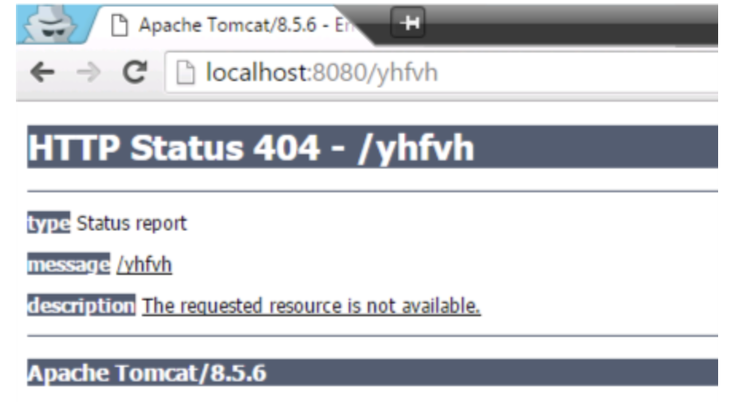

# 톰켓 서버 버전 정보 노출 안되게 하는 방법

* 하단에 보면 톰켓 버전 정보가 노출되어 있다. 이것은 해커에게 해킹의 단서를 제공할 수 있으므로 노출 시키지 않는것이 매우 중요하다. 

* 톰켓이 설치되어 있는 경로로 이동 한다.

* /bin/tomcat/lib 경로 하단에 org/apache/catalina/util/ServerInfo.properties 를 만들어 준다.

* 에디터를 활용하여 "server.info=버전정보대신 출력할 문자열" 

* 이렇게 하면 하단의 톰켓 정보대신 위에 셋팅한 문자열이 출력되게 된다.
